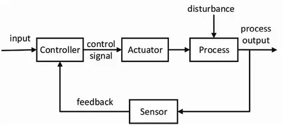

# OT Security

### What is OT Security

### 1. Topic: Control Systems (The Foundation)

### 1. Core Concept

A **Control System** is a set of devices and software that manages, commands, directs, or regulates the behavior of other devices or systems.

In the context of OT, think of it as the **"Brain"** connecting the digital world (code/logic) to the physical world (machinery/chemical processes). It takes inputs from the environment, processes them based on set logic, and produces outputs to change the environment.

### 2. Anatomy of a Control System

Every control system consists of four primary components. You can visualize this as a loop:

1. **Sensor (The Eyes/Ears):** Measures a physical variable (Temperature, Pressure, Level, Flow).
    - *Example:* A Thermocouple measuring heat in a boiler.
2. **Controller (The Brain):** Compares the measurement to a "Set Point" (desired state) and decides what to do. In OT, this is usually a PLC (Programmable Logic Controller) or DCS (Distributed Control System).
3. **Actuator (The Hands):** The mechanical device that performs the action mandated by the Controller.
    - *Example:* A motorized valve opening to let water in, or a pump turning on.6
4. **Process (The Reality):** The actual physical activity happening (e.g., water boiling, oil refining).
    
    
    

### 3. Types of Control Systems (with Examples)

There are two main types. Understanding the difference is critical for security because one implies blind execution, while the other implies self-correction.

### A. Open Loop Control System (Non-Feedback)

The system performs an action based on an input but **does not check** if the desired result was achieved.8 It assumes the action will work.

- **Real-world Example:** A basic Bread Toaster.
    - You set the timer for 2 minutes. The toaster heats for 2 minutes and pops.
    - *Deficiency:* It doesn't care if the bread is still frozen or if it’s already burnt.10 It strictly follows the time command.

### B. Closed Loop Control System (Feedback)

The system performs an action, measures the result (Feedback), and adjusts its action to minimize the error. **This is standard in Industrial Control Systems (ICS).**

- **Real-world Example:** An Air Conditioner (AC).
    - **Set Point:** You set the AC to 24°C.
    - **Sensor:** The room thermometer reads 30°C.
    - **Controller:** Calculates the "Error" (30 - 24 = 6). It commands the compressor to turn ON.
    - **Feedback Loop:** As the room cools, the sensor constantly updates the Controller. Once it hits 24°C, the Controller turns the compressor OFF.

### 4. Detailed Industrial Example: The "Boiler Pressure" Scenario

**The Goal:** Maintain safe steam pressure inside a boiler at a power plant.

1. **The Sensor:** A Pressure Transmitter sends a 4-20mA electrical signal to the PLC indicating current pressure is **200 PSI**.11
2. **The Set Point:** The Operator has programmed the PLC to maintain **150 PSI**.
3. **The Logic (Controller):** The PLC sees the pressure is too high (200 > 150). It executes logic: *"If Pressure > 150, Open Relief Valve."*
4. **The Actuator:** The PLC sends a digital signal (Modbus/Profibus) to the Relief Valve. The valve mechanically opens.
5. **The Feedback:** The pressure drops. The Sensor reports the new pressure back to the PLC.

### 5. OT Security Relevance (Why we care)

When securing a Control System, we are protecting this loop. Here is how attacks map to the components above:

- **Attacking the Sensor (Spoofing):** If a hacker feeds false data to the PLC (telling it pressure is 0 PSI when it is actually 500 PSI), the PLC will mistakenly close the valve to build pressure, potentially causing an explosion.
- **Attacking the Controller (Logic Corruption):** Malware (like Stuxnet) changes the PLC logic code so it ignores safety limits or spins rotors too fast, while telling the monitoring screen everything is fine.12
- **Attacking the Actuator (Denial of Control):** An attacker cuts the network link to the valve. The PLC knows the pressure is high, but it physically cannot send the command to open the valve.

### Basic ICS Process Models

### 1. Discrete Manufacturing

Core Concept:

Discrete manufacturing involves the production of distinct items that can be individually counted, touched, and seen. The process is series-based: raw materials enter, undergo sequential assembly steps, and emerge as a finished product. If you stop the line, you pause the creation of the next item, but you usually don't ruin the ones already made.

- **Key Characteristic:** "Start/Stop" nature. The output is quantifiable (10 cars, 500 iPhones).
- **Typical Hardware:** Heavy reliance on **PLCs** (Programmable Logic Controllers) and Robotics arms.
- **Real-World Examples:**
    - Automotive assembly lines (welding chassis, painting).
    - Electronics manufacturing (soldering motherboards).
    - Packaging and bottling plants.

**Technical Deep Dive:**

- **Logic:** Event-driven. (e.g., "If Part A arrives at Sensor B, engage Robot Arm C").
- **Data Structure:** Focuses on boolean logic (On/Off, Present/Absent) and motion control.
- **Security/Impact:**
    - **Availability is King:** Downtime translates directly to "Units per Hour" loss ($$$).
    - **Attack Vector:** Modifying the tolerance levels in a robotic arm to create subtle defects (e.g., welding slightly off-center), which ruins the product's integrity without stopping the line.

### 2. Batch Processing

Core Concept:

Batch processing is a hybrid between Discrete and Continuous. It produces finite quantities of material (a "batch") by subjecting raw materials to a specific sequence of changes over a set period, following a specific Recipe. Once a batch is finished, the equipment is cleaned/reset for the next batch.

- **Key Characteristic:** **"Recipe-Driven."** The same equipment can produce different products by simply changing the software recipe.
- **Typical Hardware:** Hybrid use of PLCs and DCS (Distributed Control Systems).
- **Real-World Examples:**
    - **Pharmaceuticals:** Mixing chemicals to create a specific drug.
    - **Food & Beverage:** Brewing beer, baking cookies, dairy processing.
    - **Specialty Chemicals:** Creating paints or adhesives.

**Technical Deep Dive:**

- **Logic:** State-based. (e.g., "Heat to 100°C for 20 mins, *then* add Ingredient X, *then* cool to 20°C").
- **Data Structure:** Complex recipe parameters stored in SQL databases or HMI/SCADA historians.
- **Security/Impact:**
    - **Integrity is King:** If a hacker alters the "Recipe" (e.g., changing the temperature set-point by 5 degrees or doubling a chemical dose), the entire batch is ruined. In Pharma, this is a life-safety issue.
    - **Attack Vector:** "Recipe Manipulation Attacks." Changing the timestamp or chemical ratio in the HMI database.

### 3. Continuous Processing

Core Concept:

Continuous processing involves a constant flow of material that undergoes chemical or physical changes. The process runs 24/7/365 and cannot be easily stopped. Stopping a continuous process is complex, expensive, and often dangerous; it can take days to restart.

- **Key Characteristic:** "Non-Stop Flow." Focus is on maintaining stability and variables (Flow, Pressure, Temperature) within a tight range.
- **Typical Hardware:** **DCS** (Distributed Control System) is the standard here due to the complexity and need for centralization.
- **Real-World Examples:**
    - Oil Refineries (Fractional Distillation).
    - Power Generation (Nuclear/Coal/Gas turbines).
    - Water Treatment Plants.

**Technical Deep Dive:**

- **Logic:** Analog-heavy. Uses PID (Proportional-Integral-Derivative) loops to constantly adjust valves to keep variables stable.
- **Data Structure:** Time-series data. Massive amounts of sensor logs analyzing trends over time.
- **Security/Impact:**
    - **Safety is King:** Loss of control doesn't just ruin a product; it causes explosions, environmental disasters, or loss of life.
    - **Attack Vector:** Disabling the **SIS (Safety Instrumented System)** while simultaneously driving the process into an unstable state (e.g., the Triton malware attack).

### Summary Comparison Table

| **Feature** | **Discrete** | **Batch** | **Continuous** |
| --- | --- | --- | --- |
| **Output** | Individual Items (Cars, Phones) | Finite Batches (Pills, Beer) | Constant Flow (Electricity, Oil) |
| **Primary Controller** | PLC | Hybrid (PLC/DCS) | DCS |
| **Key Variable** | Motion / Logic | Recipe / State | Stability / Flow |
| **Security Priority** | Availability (Uptime) | Integrity (Recipe accuracy) | Safety (Human/Environmental) |
| **Stop Consequence** | Lost Production | Ruined Batch | Hazardous Conditions / Long Restart |

### OT Security & Threat Hunting Context

When analyzing logs or designing architecture for these environments, use this context:

1. **If defending Discrete:** Look for changes in **Logic Code** (Ladder Logic updates) that shouldn't happen during production hours.
2. **If defending Batch:** Monitor the **HMI/Recipe Database**. Look for SQL injection attempts or unauthorized changes to recipe parameters (Set Points).
3. **If defending Continuous:** Monitor the **Engineering Workstation**. Any command sent to disable a safety threshold or change a PID gain value is a critical alert.

### The Triton Malware Attack

### 1. Core Concept & Significance

**Triton** is a custom-built malware framework discovered in 2017 at a petrochemical facility in Saudi Arabia.

- **The "Rubicon" Moment:** Unlike Stuxnet (which broke centrifuges) or Industroyer (which cut power), Triton targeted the **Safety Instrumented System (SIS)**.
- **The Intent:** The malware's goal was not to shut the plant down, but to **disable the safety mechanisms** so that a subsequent attack could cause a physical explosion or toxic gas release without the automatic safety triggers stopping it.
- **Status:** It is widely considered the first "Cyber-Kinetic" weapon designed specifically to cause physical harm to humans.

### 2. The Target: Schneider Electric Triconex

Triton was hyper-specific. It targeted **Triconex Safety Controllers** manufactured by Schneider Electric.

- **Role of SIS:** In a plant, the Distributed Control System (DCS) runs the process. The SIS sits silently in the background, monitoring for dangerous conditions (e.g., pressure > 900 PSI). If the DCS fails and danger is imminent, the SIS takes over to perform an "Emergency Shutdown" (ESD).
- **Triton's Goal:** Reprogram the Triconex controller to allow unsafe conditions to persist, effectively "blinding" the safety system.

### 3. Technical Deep Dive: The Attack Chain

### A. Initial Access & Lateral Movement

The attackers gained access to the IT network (likely via phishing) and moved laterally into the OT network, eventually compromising the **SIS Engineering Workstation**.

- *Note:* The SIS workstation is the Windows PC used to program the safety controllers.

### B. The Exploit Mechanism (TriStation Protocol)

Triton exploited the lack of authentication in the proprietary **TriStation** protocol (UDP port 1502).

1. **Impersonation:** The malware masqueraded as the legitimate "TriStation 1131" software.
2. **Payload Injection:** It injected a Remote Access Trojan (RAT) directly into the memory of the Triconex controller.
3. **Zero-Day:** It utilized a zero-day vulnerability in the controller's firmware to elevate privileges, allowing it to read/write memory and execute code.

### C. The Payload Logic

The malware was a Python script compiled into a Windows binary (using Py2Exe), often disguised as a legitimate file (e.g., `trilog.exe`).

- Once on the controller, it sat in a loop checking the memory state.
- It had a "kill switch": If the malware detected it was being analyzed or if specific conditions weren't met, it would attempt to overwrite its own tracks with "junk data" to hinder forensics.

### 4. Why the Attack "Failed" (The Discovery)

The attack was discovered not because the hackers succeeded, but because they made a mistake.

- **The Glitch:** While the attackers were testing their ability to write to the controller's memory, they inadvertently triggered a **Redundancy Fault**.
- **The Fail-Safe:** The Triconex controllers are designed with "Triple Modular Redundancy" (three processors voting on every decision). The malware caused a discrepancy between the processors.
- **The Shutdown:** The safety system did exactly what it was designed to do when it detects an internal error: it entered a **Safe State** (Fail-Safe) and automatically shut down the entire plant.
- **The Investigation:** Plant operators investigated the "accidental" shutdown and found the foreign code in the controller.

### 5. Detection & Defense Strategies

Defending against a Triton-style attack requires treating the SIS as a "Holy of Holies"—it must be the most secure segment of your network.

- **Network Segmentation:** The SIS network should be air-gapped or strictly firewalled from the general OT network. The SIS Engineering Workstation should **never** have dual-homed connectivity (connected to both IT and OT).
- **Physical Controls:** Use the physical **"Key Switch"** on the front of the Triconex controller.
    - *Run Mode:* The controller runs logic but rejects all program changes.
    - *Program Mode:* Allows changes.
    - *Defense:* Keep the key in "Run Mode" and remove the key physically. Triton cannot override the physical key switch.
- **Protocol Monitoring:** Monitor the **TriStation Protocol**.
    - Alert on any "Program Download" or "Write Memory" commands sent to the SIS controllers, especially during production hours.
- **File Integrity Monitoring:** Watch the Engineering Workstation for new Python binaries or unrecognized executables (like `trilog.exe`).

### 6. Summary for Exams/Interviews

| **Feature** | **Details** |
| --- | --- |
| **Malware Name** | Triton / TRISIS / HatMan |
| **Year** | 2017 |
| **Specific Target** | Schneider Electric Triconex (Safety Controllers) |
| **Protocol Abused** | TriStation (UDP 1502) |
| **Primary Impact** | Compromise of Safety Systems (Risk to Life) |
| **Discovery Cause** | Accidental plant shutdown due to controller fault during attack |

### 

### Purdue Reference Architecture

This is the absolute "Gold Standard" for network segmentation in OT. If you understand this, you understand how to isolate a threat.

### The Purdue Reference Architecture (The Layered Defense)

### 1. Core Concept

The Purdue Model is a hierarchical framework that segments an industrial network into distinct **Levels (0 to 5)**.

- **The Goal:** It creates "Zones of Trust." The higher you go, the more "IT-like" and untrusted the network is. The lower you go, the more critical and sensitive the physical process becomes.
- **The Golden Rule:** Devices in one level should only communicate with the level directly above or below it. Level 4 should **never** talk directly to Level 1.

### 2. Technical Deep Dive: The Levels (The "Layer Cake")

We build the model from the ground up (Physics to Enterprise).

### **Level 0: Physical Process (The "Thing")**

- **Definition:** The actual physical equipment doing the work.
- **Devices:** Sensors, Motors, Valves, Pumps, Robotic Arms.
- **Protocol:** Hardwired analog signals (4-20mA), basic fieldbus.
- **Security Reality:** No IP addresses here. You cannot "ping" a valve. Security is purely physical (locks and fences).

### **Level 1: Basic Control (The "Brain")**

- **Definition:** The devices that command Level 0 based on logic.
- **Devices:** PLCs (Programmable Logic Controllers), RTUs (Remote Terminal Units), VFDs (Variable Frequency Drives).
- **Protocol:** Modbus, DNP3, Profinet.
- **Security Reality:** These devices run embedded OS (often VxWorks). They prioritize speed over security. **Zero authentication** is common here.

### **Level 2: Area Supervisory Control (The "Eyes")**

- **Definition:** The interface for operators to monitor and adjust Level 1.
- **Devices:** HMI (Human Machine Interface) screens, Engineering Workstations (used to program PLCs), SCADA Masters.
- **Protocol:** Ethernet/IP, OPC UA.
- **Security Reality:** Often Windows-based PCs. Vulnerable to standard malware (ransomware) but sit inside the critical OT zone.

### **Level 3: Site Manufacturing Operations (The "Coordinator")**

- **Definition:** Systems that manage the workflow of the *entire* plant (not just one machine).
- **Devices:** Historians (databases storing process data), Domain Controllers (OT-specific), Patch Management servers.
- **Security Reality:** This is the top of the "OT Network." It aggregates data to send up to the business side.

### **Level 3.5: The Industrial DMZ (iDMZ)**

- **CRITICAL ZONE:** This is *not* a functional level but a **Security Boundary**.
- **Role:** The buffer between IT and OT. It stops direct traffic.
- **Components:** Jump Servers (Bastion Hosts), Proxies, Data Diodes (hardware that allows one-way traffic only).
- **Rule:** IT users login here first. They never login directly to Level 2.

### **Level 4: Business Logistics (The "Office")**

- **Definition:** The local IT network for the facility.
- **Devices:** Email servers, ERP (SAP/Oracle), Employee Wi-Fi, Printers.
- **Security Reality:** High risk of phishing and internet-borne attacks.

### **Level 5: Enterprise Network (The "HQ")**

- **Definition:** The corporate global network, often connecting multiple plant sites via VPN/WAN.
- **Devices:** Cloud connections, Corporate Data Centers.

### 3. Summary of Zones

| **Zone Name** | **Levels Included** | **Trust Level** | **Connectivity** |
| --- | --- | --- | --- |
| **Enterprise Zone** | Level 4, 5 | **Low** | Connected to Internet. High Phishing Risk. |
| **Industrial DMZ** | Level 3.5 | **Medium** | The Checkpoint. No direct traffic passes through. |
| **Manufacturing Zone** | Level 3 | **High** | Critical OT Servers. |
| **Cell/Area Zone** | Level 0, 1, 2 | **Critical** | The "Crown Jewels." Real-time control. |

### 4. Threat Landscape: "Jumping the Levels"

The most dangerous attacks involve **Lateral Movement** down the Purdue stack.

- **The "Purdue Violation":** If you see a packet going from **IP 192.168.1.50 (Level 4 Laptop)** directly to **IP 10.0.0.5 (Level 1 PLC)**, this is a massive red flag.
- **The Attack Path:**
    1. Attacker phishes a user in **Level 4**.
    2. Attacker steals credentials to access the **Level 3.5 Jump Server**.
    3. Attacker pivots from the Jump Server to the **Level 2 Engineering Workstation**.
    4. Attacker pushes malicious code from the Workstation to the **Level 1 PLC**.

### 5. Defense & Mitigation

1. **Firewalling:** Place firewalls explicitly between levels.
    - *Rule:* Deny all traffic from L4 to L3. Allow only specific traffic (e.g., Historian replication) via the DMZ.
2. **Jump Hosts:** Require 2-factor authentication (2FA) to access the Jump Host in Level 3.5.
3. **Data Diodes:** For high-security plants (Nuclear/Power), use Data Diodes at Level 3.5. They physically allow data to flow *out* (for monitoring) but prevent *any* packets from coming *in*.

### Roles and Responsibilities

 Individual roles

- Process Engineer: Designs and optimizes
- Field Technician: Maintains and repairs
- Programmer: Writes control logic and other software
- Operator: Manages and controls process

Organizational roles

- Owner/Operators: Purchase and use the system
    - Bear primary responsibility for safe operation and meeting regulations
- Vendors: Manufacture equipment and software
    - ABB, Alstom, Areva, Emerson, GE, Hitachi, Honeywell, Mitsubishi, Rockwell Automation,
    Schneider Electric, SEL, Siemens, Yokogawa, etc.
- Integrators: Design, configure, test, train, and refresh
    - Often provided by vendors or partners of vendors
- Government: Implement guidance and regulation
    - Primary goal is to safeguard the public good
    - Examples: NERC CIP, NIST, ENISA
    - In some instances, are owner/operators as well